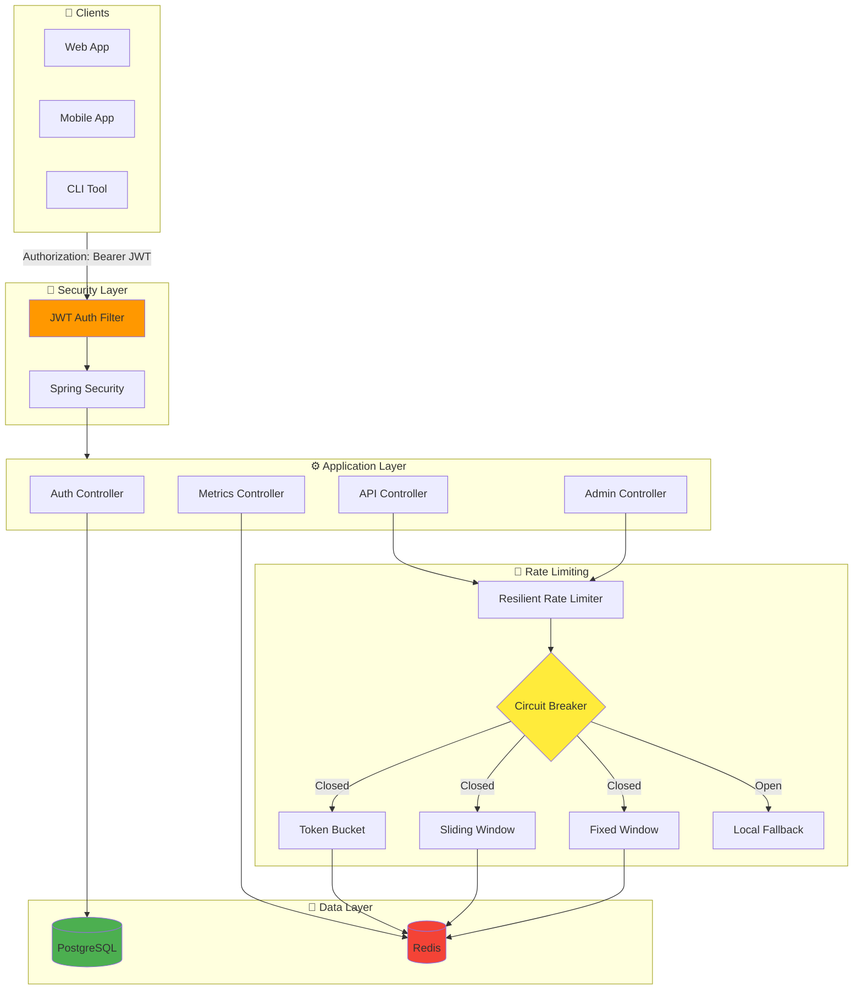
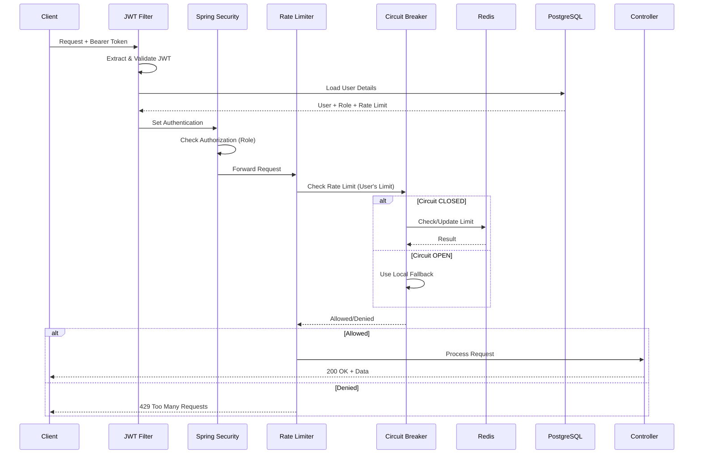
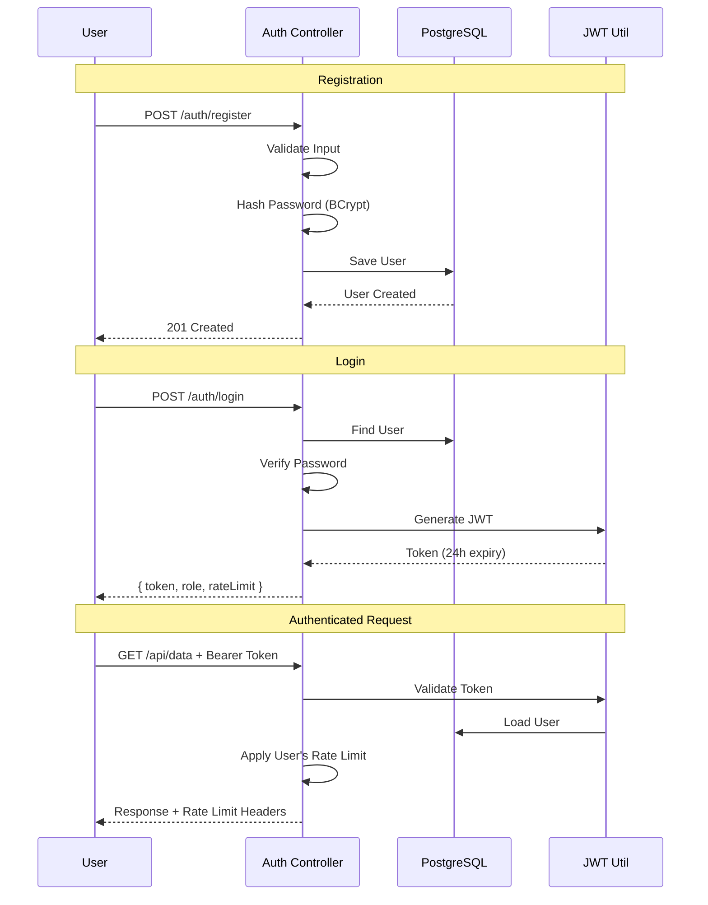
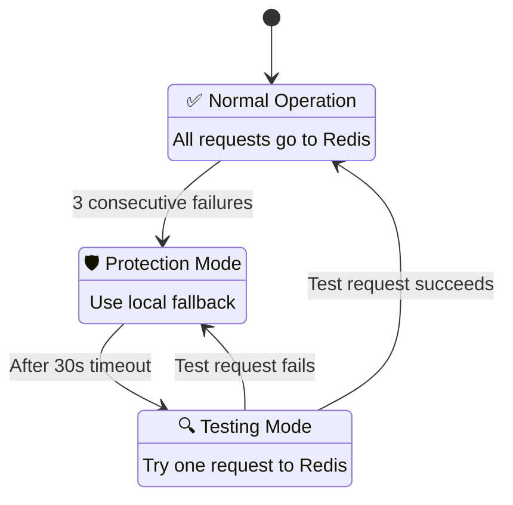

# 🚦 RateLimitX

A production-grade distributed rate limiting service built with Java Spring Boot, Redis, and PostgreSQL. Features JWT authentication, multiple rate limiting algorithms, Circuit Breaker pattern for fault tolerance, Docker containerization, and comprehensive Gatling load testing.


## 📋 Table of Contents

- [Overview](#-overview)
- [Features](#-features)
- [Architecture](#-architecture)
- [Authentication](#-authentication)
- [Algorithms](#-algorithms)
- [Circuit Breaker](#-circuit-breaker)
- [Tech Stack](#-tech-stack)
- [Getting Started](#-getting-started)
- [Docker Deployment](#-docker-deployment)
- [API Documentation](#-api-documentation)
- [Performance Testing](#-performance-testing)
- [Project Structure](#-project-structure)

---

## 🎯 Overview

RateLimitX is a distributed rate limiting service designed to protect APIs from abuse and ensure fair resource allocation. It features JWT-based authentication with role-based rate limits, multiple rate limiting algorithms that can be switched at runtime, a Circuit Breaker pattern for fault tolerance, and is fully containerized with Docker.

### Why Rate Limiting?

- **Prevent Abuse**: Stop malicious users from overwhelming your API
- **Ensure Fairness**: Allocate resources based on user tiers (FREE/PREMIUM/ADMIN)
- **Protect Infrastructure**: Prevent cascading failures during traffic spikes
- **Cost Control**: Limit expensive operations per user/tenant

### Key Highlights

- 🔐 **JWT Authentication** — Secure, stateless authentication with role-based access
- ⚡ **p95 Latency: 11ms** — Validated through Gatling load testing
- 🛡️ **99.9% Availability** — Circuit Breaker ensures service continuity
- 👥 **Tiered Rate Limits** — USER (10), PREMIUM (100), ADMIN (1000) requests/min
- 🐳 **One-Command Deployment** — Docker Compose for instant setup
- 📊 **Real-Time Metrics** — Track requests, denial rates, response times

---

## ✨ Features

### Authentication & Security
- ✅ **JWT Authentication** — Stateless token-based authentication
- ✅ **BCrypt Password Hashing** — Industry-standard password security
- ✅ **Role-Based Access Control** — USER, PREMIUM, ADMIN roles
- ✅ **Tiered Rate Limits** — Different limits based on subscription tier
- ✅ **Spring Security 6** — Comprehensive security framework

### Rate Limiting Algorithms
- ✅ **Fixed Window Counter** — Simple time-window based limiting
- ✅ **Token Bucket** — Smooth rate limiting with burst support
- ✅ **Sliding Window Counter** — Most accurate, no boundary issues
- ✅ **Atomic Redis Operations** — Lua scripts prevent race conditions
- ✅ **Runtime Algorithm Switching** — Change algorithms without restart

### Reliability Features
- ✅ **Circuit Breaker Pattern** — Automatic fallback during Redis failures
- ✅ **Local Rate Limiter Fallback** — In-memory rate limiting when Redis is down
- ✅ **Self-Healing** — Automatic recovery when Redis comes back online
- ✅ **Health Monitoring** — Real-time health checks and status endpoints

### Operations Features
- ✅ **Docker & Docker Compose** — Production-ready containerization
- ✅ **PostgreSQL Integration** — Persistent user management
- ✅ **Gatling Load Testing** — Comprehensive performance validation
- ✅ **Real-Time Metrics** — Hourly and daily statistics tracking
- ✅ **Admin Dashboard** — Monitor users, algorithms, and system health

### API Headers (RFC 6585 Compliant)
```
X-RateLimit-Limit: 10          # Maximum requests allowed
X-RateLimit-Remaining: 7       # Requests remaining in window
X-RateLimit-Reset: 45          # Seconds until limit resets
X-Algorithm: sliding-window    # Active algorithm
X-User-Role: PREMIUM           # User's role/tier
Retry-After: 45                # When client should retry (on 429)
```

---

## 🏗 Architecture

### High-Level Overview



### Request Flow



### Detailed Architecture

```
┌─────────────────────────────────────────────────────────────────────────────────┐
│                              CLIENT REQUEST                                      │
│                     Authorization: Bearer <JWT Token>                            │
└─────────────────────────────────┬───────────────────────────────────────────────┘
                                  │
                                  ▼
┌─────────────────────────────────────────────────────────────────────────────────┐
│                           SECURITY LAYER                                         │
│  ┌─────────────────────┐    ┌─────────────────────┐    ┌─────────────────────┐  │
│  │   JWT Auth Filter   │───▶│   Spring Security   │───▶│   Role Validator    │  │
│  │                     │    │                     │    │                     │  │
│  │ • Extract Token     │    │ • Authenticate      │    │ • USER: /api/**     │  │
│  │ • Validate Signature│    │ • Load UserDetails  │    │ • ADMIN: /admin/**  │  │
│  │ • Check Expiration  │    │ • Set Context       │    │ • Public: /auth/**  │  │
│  └─────────────────────┘    └─────────────────────┘    └─────────────────────┘  │
└─────────────────────────────────┬───────────────────────────────────────────────┘
                                  │
                                  ▼
┌─────────────────────────────────────────────────────────────────────────────────┐
│                          CONTROLLER LAYER                                        │
│  ┌──────────────┐  ┌──────────────┐  ┌──────────────┐  ┌──────────────────────┐ │
│  │     Auth     │  │     API      │  │    Admin     │  │      Metrics         │ │
│  │  Controller  │  │  Controller  │  │  Controller  │  │     Controller       │ │
│  │              │  │              │  │              │  │                      │ │
│  │ • register   │  │ • data       │  │ • health     │  │ • summary            │ │
│  │ • login      │  │ • status     │  │ • stats      │  │ • hourly/daily       │ │
│  │ • me         │  │              │  │ • circuit    │  │ • user/{id}          │ │
│  └──────┬───────┘  └──────┬───────┘  └──────┬───────┘  └──────────┬───────────┘ │
└─────────┼─────────────────┼─────────────────┼─────────────────────┼─────────────┘
          │                 │                 │                     │
          │                 ▼                 │                     │
          │  ┌──────────────────────────────────────────────────────┼─────────────┐
          │  │              RATE LIMITING LAYER                     │             │
          │  │  ┌────────────────────────────────────────────────┐  │             │
          │  │  │           RESILIENT RATE LIMITER               │  │             │
          │  │  │  ┌──────────────────────────────────────────┐  │  │             │
          │  │  │  │            CIRCUIT BREAKER                │  │  │             │
          │  │  │  │    CLOSED ◄──► OPEN ◄──► HALF_OPEN       │  │  │             │
          │  │  │  └──────────────────┬───────────────────────┘  │  │             │
          │  │  │                     │                          │  │             │
          │  │  │         ┌───────────┴───────────┐              │  │             │
          │  │  │         ▼                       ▼              │  │             │
          │  │  │  ┌─────────────┐        ┌─────────────┐        │  │             │
          │  │  │  │   PRIMARY   │        │  FALLBACK   │        │  │             │
          │  │  │  │   (Redis)   │        │  (Memory)   │        │  │             │
          │  │  │  │             │        │             │        │  │             │
          │  │  │  │• Token Bucket│       │• Local Rate │        │  │             │
          │  │  │  │• Sliding Win │       │  Limiter    │        │  │             │
          │  │  │  │• Fixed Window│       │             │        │  │             │
          │  │  │  └──────┬──────┘        └─────────────┘        │  │             │
          │  │  └─────────┼──────────────────────────────────────┘  │             │
          │  └────────────┼─────────────────────────────────────────┘             │
          │               │                                                       │
          ▼               ▼                                                       ▼
┌─────────────────┐  ┌─────────────────────────────────────────┐  ┌───────────────┐
│   POSTGRESQL    │  │                 REDIS                   │  │    REDIS      │
│   (Port 5432)   │  │              (Port 6379)                │  │   (Metrics)   │
│                 │  │                                         │  │               │
│  ┌───────────┐  │  │  ┌─────────────┐  ┌─────────────────┐  │  │  metrics:*    │
│  │  users    │  │  │  │ Rate Limits │  │  User Limits    │  │  │  • hourly     │
│  │  table    │  │  │  │             │  │                 │  │  │  • daily      │
│  │           │  │  │  │ rate:*      │  │  user-limits    │  │  │  • per-user   │
│  │ • id      │  │  │  │ bucket:*    │  │  (hash)         │  │  │               │
│  │ • username│  │  │  │ sliding:*   │  │                 │  │  └───────────────┘
│  │ • email   │  │  │  │             │  │                 │  │
│  │ • password│  │  │  │ Lua Scripts │  │                 │  │
│  │ • role    │  │  │  │ (Atomic)    │  │                 │  │
│  │ • rateLimit│ │  │  └─────────────┘  └─────────────────┘  │
│  └───────────┘  │  │                                         │
└─────────────────┘  └─────────────────────────────────────────┘
```

---

## 🔐 Authentication

RateLimitX uses JWT (JSON Web Token) for stateless authentication with role-based rate limiting.

### Authentication Flow



### User Roles & Rate Limits

| Role | Rate Limit | Access Level |
|------|------------|--------------|
| **USER** | 10 req/min | `/api/**`, `/auth/**` |
| **PREMIUM** | 100 req/min | `/api/**`, `/auth/**` |
| **ADMIN** | 1000 req/min | All endpoints including `/admin/**` |

### JWT Token Structure

```
eyJhbGciOiJIUzI1NiJ9.eyJyb2xlIjoiUk9MRV9VU0VSIiwicmF0ZUxpbWl0IjoxMCwic3ViIjoicnVndmVkIiwiaWF0IjoxNzA2MzAwMDAwLCJleHAiOjE3MDYzODY0MDB9.xxx

┌─────────────────┬────────────────────────────────────────┬─────────────────┐
│     HEADER      │              PAYLOAD                   │    SIGNATURE    │
├─────────────────┼────────────────────────────────────────┼─────────────────┤
│ {               │ {                                      │                 │
│   "alg":"HS256",│   "role": "ROLE_USER",                │  HMAC-SHA256    │
│   "typ":"JWT"   │   "rateLimit": 10,                    │  (secret key)   │
│ }               │   "sub": "rugved",                    │                 │
│                 │   "iat": 1706300000,                  │                 │
│                 │   "exp": 1706386400                   │                 │
│                 │ }                                      │                 │
└─────────────────┴────────────────────────────────────────┴─────────────────┘
```

### Security Features

| Feature | Implementation |
|---------|----------------|
| **Password Hashing** | BCrypt (10 rounds) |
| **Token Signing** | HMAC-SHA256 |
| **Token Expiry** | 24 hours |
| **Session Management** | Stateless |
| **CSRF Protection** | Disabled (stateless) |

---

## 🔄 Algorithms

### 1. Fixed Window Counter

**How it works**: Counts requests in fixed time windows (e.g., per minute).
```
Minute 1              Minute 2              Minute 3
├────────────────────┼────────────────────┼────────────────────┤
│ ██████████ 10 req  │ ██████████ 10 req  │ ██████████ 10 req  │
│ (resets at end)    │ (resets at end)    │ (resets at end)    │
```

| Pros | Cons |
|------|------|
| Simple to implement | Boundary burst problem |
| Low memory usage | Can allow 2x limit at window edges |
| O(1) operations | Hard reset may surprise users |

**Best for**: Simple APIs, internal services

---

### 2. Token Bucket

**How it works**: Tokens are added at a fixed rate. Each request consumes a token.
```
Bucket Capacity: 10 tokens
Refill Rate: 1 token/second

[🪙🪙🪙🪙🪙🪙🪙⚪⚪⚪]  7 tokens available
         │
    Request (costs 1 token)
         │
         ▼
[🪙🪙🪙🪙🪙🪙⚪⚪⚪⚪]  6 tokens remaining
```

| Pros | Cons |
|------|------|
| Allows controlled bursts | More complex state |
| Smooth rate limiting | Requires tuning |
| Industry standard (AWS, Stripe) | Two parameters to configure |

**Best for**: Public APIs, services needing burst capacity

---

### 3. Sliding Window Counter

**How it works**: Combines current and previous window with weighted average.
```
Current time: 45 seconds into current window

Previous Window    Current Window
│    8 requests    │    4 requests    │
│      (25%)       │     (100%)       │
└──────────────────┴──────────────────┘

Weighted count = (8 × 0.25) + (4 × 1.0) = 6 requests
```

| Pros | Cons |
|------|------|
| No boundary burst | Slightly more complex |
| Most accurate | Multiple Redis keys per user |
| Smooth experience | More memory usage |

**Best for**: High-accuracy APIs, premium tier rate limiting

---

## 🛡️ Circuit Breaker

RateLimitX implements the Circuit Breaker pattern to ensure high availability even during Redis failures.

### State Machine



### Configuration

| Parameter | Value | Description |
|-----------|-------|-------------|
| Failure Threshold | 3 | Failures before opening circuit |
| Timeout Duration | 30s | Time before testing recovery |
| Fallback Strategy | Local Rate Limiter | In-memory when Redis is down |

### Monitoring
```bash
# Check circuit breaker status
curl http://localhost:8080/admin/circuit \
  -H "Authorization: Bearer <admin-token>"

# Response
{
  "state": "CLOSED",
  "failureCount": 0,
  "failureThreshold": 3,
  "isAllowingRequests": true,
  "currentMode": "sliding-window"
}
```

---

## 🛠 Tech Stack

| Component | Technology | Purpose |
|-----------|------------|---------|
| **Language** | Java 17+ | Core application |
| **Framework** | Spring Boot 3.x | REST API, dependency injection |
| **Security** | Spring Security 6.x | Authentication & authorization |
| **Authentication** | JWT (jjwt 0.12.3) | Stateless token-based auth |
| **Database** | PostgreSQL 16 | User management & persistence |
| **Cache** | Redis 7.x | Distributed rate limit storage |
| **ORM** | Spring Data JPA | Database operations |
| **Scripting** | Lua | Atomic Redis operations |
| **Containerization** | Docker & Docker Compose | Deployment |
| **Load Testing** | Gatling | Performance validation |
| **Build** | Maven | Dependency management |

---

## 🚀 Getting Started

### Prerequisites

- Java 17 or higher
- Maven 3.6+
- Docker & Docker Compose (recommended)

### Quick Start with Docker (Recommended)

```bash
# Clone the repository
git clone https://github.com/yourusername/ratelimitx.git
cd ratelimitx

# Start everything with one command
docker-compose up --build

# Verify it's working
curl http://localhost:8080/admin/health
```

### Local Development

**1. Start PostgreSQL and Redis**
```bash
# Using Docker for databases only
docker run -d --name postgres -p 5432:5432 \
  -e POSTGRES_DB=ratelimitx \
  -e POSTGRES_USER=ratelimitx \
  -e POSTGRES_PASSWORD=ratelimitx123 \
  postgres:16-alpine

docker run -d --name redis -p 6379:6379 redis:7-alpine
```

**2. Run the application**
```bash
./mvnw spring-boot:run
```

**3. Test the endpoints**
```bash
# Health check
curl http://localhost:8080/admin/health

# Register a user
curl -X POST http://localhost:8080/auth/register \
  -H "Content-Type: application/json" \
  -d '{"username":"testuser","email":"test@example.com","password":"password123"}'

# Login
curl -X POST http://localhost:8080/auth/login \
  -H "Content-Type: application/json" \
  -d '{"username":"testuser","password":"password123"}'
```

---

## 🐳 Docker Deployment

### Docker Architecture

```
┌─────────────────────────────────────────────────────────────────┐
│                      DOCKER COMPOSE                             │
│                                                                 │
│  ┌─────────────┐  ┌─────────────┐  ┌─────────────────────────┐ │
│  │  postgres   │  │    redis    │  │          app            │ │
│  │  container  │  │  container  │  │       container         │ │
│  │             │  │             │  │                         │ │
│  │ Port: 5432  │  │ Port: 6379  │  │      Port: 8080         │ │
│  │             │  │             │  │                         │ │
│  │ healthcheck │  │ healthcheck │  │  depends_on: healthy    │ │
│  └──────┬──────┘  └──────┬──────┘  └───────────┬─────────────┘ │
│         │                │                     │               │
│         └────────────────┴─────────────────────┘               │
│                    ratelimitx-network                          │
│                                                                 │
│  Volumes: postgres-data, redis-data                            │
└─────────────────────────────────────────────────────────────────┘
```

### Docker Commands

```bash
# Build and start all services
docker-compose up --build

# Start in background
docker-compose up -d

# View logs
docker-compose logs -f app

# Stop everything
docker-compose down

# Fresh start (remove all data)
docker-compose down -v

# Enter containers
docker exec -it ratelimitx-app sh
docker exec -it ratelimitx-redis redis-cli
docker exec -it ratelimitx-postgres psql -U ratelimitx -d ratelimitx
```

---

## 📖 API Documentation

### Authentication Endpoints

#### Register User
```http
POST /auth/register
Content-Type: application/json

{
  "username": "rugved",
  "email": "rugved@example.com",
  "password": "password123"
}
```

**Response (201 Created):**
```json
{
  "message": "User registered successfully",
  "username": "rugved",
  "role": "USER",
  "rateLimit": 10
}
```

#### Login
```http
POST /auth/login
Content-Type: application/json

{
  "username": "rugved",
  "password": "password123"
}
```

**Response (200 OK):**
```json
{
  "token": "eyJhbGciOiJIUzI1NiJ9...",
  "tokenType": "Bearer",
  "expiresIn": 86400,
  "username": "rugved",
  "role": "USER",
  "rateLimit": 10
}
```

#### Get Current User
```http
GET /auth/me
Authorization: Bearer <token>
```

**Response (200 OK):**
```json
{
  "username": "rugved",
  "email": "rugved@example.com",
  "role": "USER",
  "rateLimit": 10,
  "createdAt": "2024-01-27T10:30:00"
}
```

---

### Rate Limited Endpoints

#### Get Data (Protected)
```http
GET /api/data
Authorization: Bearer <token>
```

**Response Headers:**
```
X-RateLimit-Limit: 10
X-RateLimit-Remaining: 7
X-RateLimit-Reset: 45
X-Algorithm: sliding-window
X-User-Role: USER
```

**Response (200 OK):**
```
Success! Here's your data
```

**Response (429 Too Many Requests):**
```
Rate limit exceeded. Retry after 45000ms
```

---

### Admin Endpoints (ADMIN role required)

#### Health Check (Public)
```http
GET /admin/health
```
```json
{
  "redis": "UP",
  "status": "HEALTHY",
  "algorithm": "sliding-window"
}
```

#### Circuit Breaker Status
```http
GET /admin/circuit
Authorization: Bearer <admin-token>
```
```json
{
  "state": "CLOSED",
  "failureCount": 0,
  "failureThreshold": 3,
  "timeoutDurationMs": 30000,
  "isAllowingRequests": true,
  "currentMode": "sliding-window"
}
```

#### System Stats
```http
GET /admin/stats
Authorization: Bearer <admin-token>
```
```json
{
  "activeUsers": 42,
  "totalActiveKeys": 156,
  "activeAlgorithm": "sliding-window",
  "uptimeSeconds": 3600,
  "memoryUsedMB": 128,
  "memoryMaxMB": 512
}
```

---

### Metrics Endpoints

#### Metrics Summary
```http
GET /metrics/summary
Authorization: Bearer <token>
```
```json
{
  "currentHour": {
    "totalRequests": 500,
    "allowedRequests": 450,
    "deniedRequests": 50,
    "avgResponseTimeMs": "2.35",
    "successRate": "90.00%"
  },
  "currentDay": {
    "totalRequests": 5000,
    "allowedRequests": 4500,
    "deniedRequests": 500,
    "successRate": "90.00%"
  },
  "hourlyDenialRate": "10.00%",
  "requestsPerMinute": "8.33"
}
```

---

## ⚡ Performance Testing

### Gatling Load Tests

```bash
# Start the application
docker-compose up -d

# Run Gatling tests
mvn gatling:test

# View report
open target/gatling/*/index.html
```

### Performance Results

| Metric | Value | Industry Standard |
|--------|-------|-------------------|
| **p50 Latency** | 6ms | < 100ms |
| **p95 Latency** | 11ms | < 200ms |
| **p99 Latency** | 30ms | < 500ms |
| **Max Latency** | 72ms | < 1000ms |
| **Success Rate** | 100% | > 99% |
| **Throughput** | 4,500+ req/sec | - |

---

## 📁 Project Structure

```
RateLimitX/
├── Dockerfile                              # Multi-stage build
├── docker-compose.yml                      # Container orchestration
├── pom.xml                                 # Maven dependencies
│
├── src/main/java/com/ratelimitx/core/
│   ├── RateLimitXApplication.java          # Main entry point
│   │
│   ├── config/
│   │   ├── RateLimitConfig.java            # Rate limit configuration
│   │   └── RedisConfig.java                # Redis connection setup
│   │
│   ├── controller/
│   │   ├── ApiController.java              # Rate-limited API endpoint
│   │   ├── AdminController.java            # Admin & monitoring
│   │   ├── AuthController.java             # Authentication endpoints
│   │   └── MetricsController.java          # Metrics endpoints
│   │
│   ├── dto/
│   │   ├── AuthResponse.java               # Login response DTO
│   │   ├── LoginRequest.java               # Login request DTO
│   │   └── RegisterRequest.java            # Registration DTO
│   │
│   ├── entity/
│   │   ├── Role.java                       # User roles enum
│   │   └── User.java                       # User JPA entity
│   │
│   ├── repository/
│   │   └── UserRepository.java             # User database operations
│   │
│   ├── security/
│   │   ├── CustomUserDetailsService.java   # User loading service
│   │   ├── JwtAuthenticationFilter.java    # JWT validation filter
│   │   ├── JwtUtil.java                    # JWT operations
│   │   └── SecurityConfig.java             # Spring Security config
│   │
│   ├── circuitbreaker/
│   │   ├── CircuitBreaker.java             # Circuit breaker logic
│   │   ├── CircuitBreakerState.java        # State enum
│   │   └── LocalRateLimiter.java           # In-memory fallback
│   │
│   ├── model/
│   │   └── RateLimitResult.java            # Rate limit result
│   │
│   └── service/
│       ├── RateLimiterService.java         # Fixed Window
│       ├── TokenBucketService.java         # Token Bucket
│       ├── SlidingWindowService.java       # Sliding Window
│       ├── ResilientRateLimiter.java       # Circuit breaker integration
│       └── MetricsService.java             # Metrics tracking
│
├── src/main/resources/
│   └── application.properties              # Configuration
│
└── src/test/scala/loadtest/
    └── RateLimitXSimulation.scala          # Gatling load tests
```

---

## 🧪 Quick Testing

### Complete Test Flow
```bash
# 1. Start services
docker-compose up -d

# 2. Check health (public endpoint)
curl http://localhost:8080/admin/health

# 3. Register a user
curl -X POST http://localhost:8080/auth/register \
  -H "Content-Type: application/json" \
  -d '{"username":"testuser","email":"test@example.com","password":"password123"}'

# 4. Login and get token
TOKEN=$(curl -s -X POST http://localhost:8080/auth/login \
  -H "Content-Type: application/json" \
  -d '{"username":"testuser","password":"password123"}' | jq -r '.token')

echo "Token: $TOKEN"

# 5. Access protected endpoint
curl http://localhost:8080/api/data \
  -H "Authorization: Bearer $TOKEN"

# 6. Test rate limiting (send 12 requests, limit is 10)
for i in {1..12}; do
  echo "Request $i:"
  curl -s http://localhost:8080/api/data \
    -H "Authorization: Bearer $TOKEN"
  echo ""
done

# 7. Check your rate limit status
curl http://localhost:8080/api/status \
  -H "Authorization: Bearer $TOKEN"
```

### Circuit Breaker Test
```bash
# Check initial state
curl http://localhost:8080/admin/health

# Stop Redis
docker stop ratelimitx-redis

# Requests still work (fallback mode)
curl http://localhost:8080/api/data \
  -H "Authorization: Bearer $TOKEN"

# Restart Redis
docker start ratelimitx-redis
```

---

## 📊 Configuration

### application.properties
```properties
# Server
server.port=8080

# PostgreSQL
spring.datasource.url=jdbc:postgresql://localhost:5432/ratelimitx
spring.datasource.username=ratelimitx
spring.datasource.password=ratelimitx123

# Redis
spring.data.redis.host=localhost
spring.data.redis.port=6379

# JWT
jwt.secret=your-secret-key-here
jwt.expiration=86400000

# Rate Limiting
ratelimit.algorithm=sliding-window
ratelimit.max-requests=10
ratelimit.window-size-seconds=60
```

---

## 🎯 Use Cases

| Use Case | Recommended Setup |
|----------|-------------------|
| **Public API** | Token Bucket, JWT auth, tiered limits |
| **SaaS Application** | Sliding Window, USER/PREMIUM/ADMIN tiers |
| **Internal Services** | Fixed Window, simple config |
| **High-Traffic API** | Token Bucket with Redis cluster |

---

## 👨‍💻 Author

**Rugved Gundawar**

- GitHub: [@Rugved-142](https://github.com/Rugved-142)
- LinkedIn: [Rugved Gundawar](https://www.linkedin.com/in/rugved-gundawar/)

---

## 📝 License

This project is licensed under the MIT License - see the [LICENSE](LICENSE) file for details.
