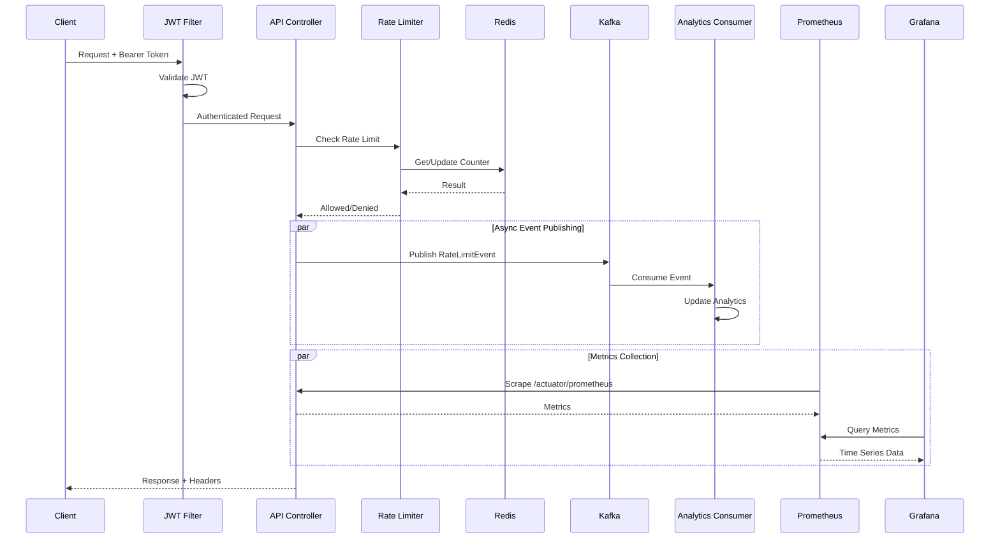
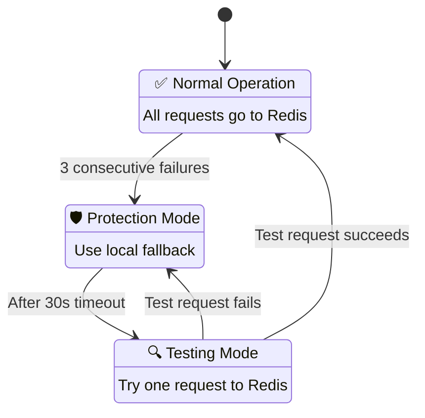

# 🚦 RateLimitX

A production-grade distributed rate limiting service built with Java Spring Boot, Redis, PostgreSQL, and Kafka. Features JWT authentication, multiple rate limiting algorithms, Circuit Breaker pattern for fault tolerance, event-driven analytics with Kafka, and real-time monitoring with Prometheus and Grafana.


## 📋 Table of Contents

- [Overview](#-overview)
- [Features](#-features)
- [Architecture](#-architecture)
- [Authentication](#-authentication)
- [Algorithms](#-algorithms)
- [Event Streaming](#-event-streaming)
- [Monitoring](#-monitoring)
- [Circuit Breaker](#-circuit-breaker)
- [Tech Stack](#-tech-stack)
- [Getting Started](#-getting-started)
- [Docker Deployment](#-docker-deployment)
- [API Documentation](#-api-documentation)
- [Performance Testing](#-performance-testing)
- [Project Structure](#-project-structure)

---

## 🎯 Overview

RateLimitX is a distributed rate limiting service designed to protect APIs from abuse and ensure fair resource allocation. It features JWT-based authentication with role-based rate limits, multiple rate limiting algorithms that can be switched at runtime, event-driven analytics with Apache Kafka, real-time monitoring with Prometheus and Grafana, a Circuit Breaker pattern for fault tolerance, and is fully containerized with Docker.

### Why Rate Limiting?

- **Prevent Abuse**: Stop malicious users from overwhelming your API
- **Ensure Fairness**: Allocate resources based on user tiers (FREE/PREMIUM/ADMIN)
- **Protect Infrastructure**: Prevent cascading failures during traffic spikes
- **Cost Control**: Limit expensive operations per user/tenant

### Key Highlights

- 🔐 **JWT Authentication** — Secure, stateless authentication with role-based access
- ⚡ **p95 Latency: 11ms** — Validated through Gatling load testing
- 🛡️ **99.9% Availability** — Circuit Breaker ensures service continuity
- 👥 **Tiered Rate Limits** — USER (10), PREMIUM (100), ADMIN (1000) requests/min
- 📨 **Event-Driven Analytics** — Apache Kafka for async event streaming
- 📊 **Real-Time Dashboards** — Prometheus metrics + Grafana visualizations
- 🐳 **One-Command Deployment** — Docker Compose orchestrating 7 services

---

## ✨ Features

### Authentication & Security
- ✅ **JWT Authentication** — Stateless token-based authentication
- ✅ **BCrypt Password Hashing** — Industry-standard password security
- ✅ **Role-Based Access Control** — USER, PREMIUM, ADMIN roles
- ✅ **Tiered Rate Limits** — Different limits based on subscription tier
- ✅ **Spring Security 6** — Comprehensive security framework

### Rate Limiting Algorithms
- ✅ **Fixed Window Counter** — Simple time-window based limiting
- ✅ **Token Bucket** — Smooth rate limiting with burst support
- ✅ **Sliding Window Counter** — Most accurate, no boundary issues
- ✅ **Atomic Redis Operations** — Lua scripts prevent race conditions
- ✅ **Runtime Algorithm Switching** — Change algorithms without restart

### Event Streaming (Kafka)
- ✅ **Async Event Publishing** — Non-blocking event streaming
- ✅ **Real-Time Analytics** — Track usage patterns as they happen
- ✅ **Decoupled Consumers** — Independent analytics and alerting pipelines
- ✅ **Event Replay** — Rebuild analytics from stored events
- ✅ **Partitioned Topics** — Parallel processing for scalability

### Monitoring & Observability
- ✅ **Prometheus Metrics** — Time-series metrics collection
- ✅ **Grafana Dashboards** — Real-time visualization
- ✅ **Custom Metrics** — Request rates, latencies, denial rates
- ✅ **JVM Monitoring** — Memory, CPU, thread metrics
- ✅ **Auto-Provisioned** — Dashboards ready on startup

### Reliability Features
- ✅ **Circuit Breaker Pattern** — Automatic fallback during Redis failures
- ✅ **Local Rate Limiter Fallback** — In-memory rate limiting when Redis is down
- ✅ **Self-Healing** — Automatic recovery when Redis comes back online
- ✅ **Health Monitoring** — Real-time health checks and status endpoints

### Operations Features
- ✅ **Docker & Docker Compose** — Production-ready containerization
- ✅ **7 Orchestrated Services** — App, PostgreSQL, Redis, Kafka, Zookeeper, Prometheus, Grafana
- ✅ **Gatling Load Testing** — Comprehensive performance validation
- ✅ **Kafka UI** — Visual topic and message inspection

### API Headers (RFC 6585 Compliant)
```
X-RateLimit-Limit: 10          # Maximum requests allowed
X-RateLimit-Remaining: 7       # Requests remaining in window
X-RateLimit-Reset: 45          # Seconds until limit resets
X-Algorithm: sliding-window    # Active algorithm
X-User-Role: PREMIUM           # User's role/tier
Retry-After: 45                # When client should retry (on 429)
```

---

## 🏗 Architecture

### High-Level Overview


```mermaid
flowchart TB
    subgraph Clients["👥 Clients"]
        WEB[Web App]
        MOBILE[Mobile App]
        CLI[CLI Tool]
    end

    subgraph Gateway["🔐 Security Layer"]
        JWT[JWT Auth Filter]
        SEC[Spring Security]
    end

    subgraph App["⚙️ Application Layer"]
        AUTH[Auth Controller]
        API[API Controller]
        ADMIN[Admin Controller]
        ANALYTICS[Analytics Controller]
    end

    subgraph RateLimit["🚦 Rate Limiting"]
        RL[Resilient Rate Limiter]
        CB{Circuit Breaker}
        TB[Token Bucket]
        SW[Sliding Window]
        FW[Fixed Window]
        LOCAL[Local Fallback]
    end

    subgraph EventStream["📨 Event Streaming"]
        PRODUCER[Kafka Producer]
        KAFKA[(Apache Kafka)]
        CONSUMER[Analytics Consumer]
    end

    subgraph Monitoring["📊 Monitoring"]
        PROM[(Prometheus)]
        GRAF[Grafana]
    end

    subgraph Data["💾 Data Layer"]
        PG[(PostgreSQL)]
        REDIS[(Redis)]
    end

    Clients -->|"Authorization: Bearer JWT"| JWT
    JWT --> SEC
    SEC --> App
    
    AUTH --> PG
    API --> RL
    API --> PRODUCER
    
    RL --> CB
    CB -->|Closed| TB & SW & FW
    CB -->|Open| LOCAL
    TB & SW & FW --> REDIS
    
    PRODUCER --> KAFKA
    KAFKA --> CONSUMER
    
    App -->|/actuator/prometheus| PROM
    PROM --> GRAF

    style JWT fill:#ff9800
    style CB fill:#ffeb3b
    style KAFKA fill:#231f20
    style PROM fill:#e6522c
    style GRAF fill:#f46800
```

### Complete Architecture

```
┌─────────────────────────────────────────────────────────────────────────────────────┐
│                              CLIENT REQUEST                                          │
│                     Authorization: Bearer <JWT Token>                                │
└─────────────────────────────────┬───────────────────────────────────────────────────┘
                                  │
                                  ▼
┌─────────────────────────────────────────────────────────────────────────────────────┐
│                           SECURITY LAYER                                             │
│  ┌─────────────────────┐    ┌─────────────────────┐    ┌─────────────────────────┐  │
│  │   JWT Auth Filter   │───▶│   Spring Security   │───▶│   Role Validator        │  │
│  │                     │    │                     │    │                         │  │
│  │ • Extract Token     │    │ • Authenticate      │    │ • USER: /api/**         │  │
│  │ • Validate Signature│    │ • Load UserDetails  │    │ • ADMIN: /admin/**      │  │
│  │ • Check Expiration  │    │ • Set Context       │    │ • Public: /auth/**, /actuator/** │
│  └─────────────────────┘    └─────────────────────┘    └─────────────────────────┘  │
└─────────────────────────────────┬───────────────────────────────────────────────────┘
                                  │
                                  ▼
┌─────────────────────────────────────────────────────────────────────────────────────┐
│                          CONTROLLER LAYER                                            │
│  ┌────────────┐  ┌────────────┐  ┌────────────┐  ┌────────────┐  ┌──────────────┐  │
│  │    Auth    │  │    API     │  │   Admin    │  │  Metrics   │  │  Analytics   │  │
│  │ Controller │  │ Controller │  │ Controller │  │ Controller │  │  Controller  │  │
│  │            │  │            │  │            │  │            │  │              │  │
│  │ • register │  │ • data     │  │ • health   │  │ • summary  │  │ • summary    │  │
│  │ • login    │  │ • status   │  │ • stats    │  │ • hourly   │  │ • user/{id}  │  │
│  │ • me       │  │            │  │ • circuit  │  │ • daily    │  │ • top-denied │  │
│  └─────┬──────┘  └─────┬──────┘  └─────┬──────┘  └─────┬──────┘  └──────┬───────┘  │
└────────┼───────────────┼───────────────┼───────────────┼────────────────┼──────────┘
         │               │               │               │                │
         │               ▼               │               │                │
         │  ┌────────────────────────────┴───────────────┴────────────────┴──────────┐
         │  │                      RATE LIMITING LAYER                               │
         │  │  ┌──────────────────────────────────────────────────────────────────┐ │
         │  │  │                    RESILIENT RATE LIMITER                        │ │
         │  │  │  ┌────────────────────────────────────────────────────────────┐  │ │
         │  │  │  │                    CIRCUIT BREAKER                          │  │ │
         │  │  │  │          CLOSED ◄──► OPEN ◄──► HALF_OPEN                   │  │ │
         │  │  │  └────────────────────────┬───────────────────────────────────┘  │ │
         │  │  │                           │                                      │ │
         │  │  │               ┌───────────┴───────────┐                          │ │
         │  │  │               ▼                       ▼                          │ │
         │  │  │        ┌─────────────┐        ┌─────────────┐                    │ │
         │  │  │        │   PRIMARY   │        │  FALLBACK   │                    │ │
         │  │  │        │   (Redis)   │        │  (Memory)   │                    │ │
         │  │  │        │             │        │             │                    │ │
         │  │  │        │• Token Bucket│       │• Local Rate │                    │ │
         │  │  │        │• Sliding Win │       │  Limiter    │                    │ │
         │  │  │        │• Fixed Window│       │             │                    │ │
         │  │  │        └──────┬──────┘        └─────────────┘                    │ │
         │  │  └───────────────┼──────────────────────────────────────────────────┘ │
         │  └──────────────────┼──────────────────────────────────────────────────┘  │
         │                     │                                                      │
         │                     │                                                      │
         │                     │         ┌────────────────────────────────────────┐  │
         │                     │         │         EVENT STREAMING               │  │
         │                     │         │                                        │  │
         │                     │         │  API Controller                        │  │
         │                     │         │       │                                │  │
         │                     │         │       ▼ (async)                        │  │
         │                     │         │  ┌─────────────┐                       │  │
         │                     │         │  │   Kafka     │                       │  │
         │                     │         │  │  Producer   │                       │  │
         │                     │         │  └──────┬──────┘                       │  │
         │                     │         │         │                              │  │
         │                     │         │         ▼                              │  │
         │                     │         │  ┌─────────────────────────────────┐   │  │
         │                     │         │  │         KAFKA BROKER            │   │  │
         │                     │         │  │                                 │   │  │
         │                     │         │  │  Topic: rate-limit-events       │   │  │
         │                     │         │  │  ├── Partition 0                │   │  │
         │                     │         │  │  ├── Partition 1                │   │  │
         │                     │         │  │  └── Partition 2                │   │  │
         │                     │         │  └─────────────┬───────────────────┘   │  │
         │                     │         │                │                       │  │
         │                     │         │                ▼                       │  │
         │                     │         │  ┌─────────────────────────────────┐   │  │
         │                     │         │  │     Analytics Consumer          │   │  │
         │                     │         │  │                                 │   │  │
         │                     │         │  │  • Count requests               │   │  │
         │                     │         │  │  • Track denial rates           │   │  │
         │                     │         │  │  • Detect abuse patterns        │   │  │
         │                     │         │  └─────────────────────────────────┘   │  │
         │                     │         │                                        │  │
         │                     │         └────────────────────────────────────────┘  │
         │                     │                                                      │
         ▼                     ▼                                                      │
┌─────────────────┐  ┌─────────────────┐                                             │
│   POSTGRESQL    │  │      REDIS      │                                             │
│   (Port 5432)   │  │   (Port 6379)   │                                             │
│                 │  │                 │                                             │
│  ┌───────────┐  │  │  ┌───────────┐  │                                             │
│  │  users    │  │  │  │Rate Limits│  │                                             │
│  │  table    │  │  │  │           │  │                                             │
│  │           │  │  │  │ rate:*    │  │                                             │
│  │ • id      │  │  │  │ bucket:*  │  │                                             │
│  │ • username│  │  │  │ sliding:* │  │                                             │
│  │ • password│  │  │  │           │  │                                             │
│  │ • role    │  │  │  │ Lua Scripts│ │                                             │
│  │ • rateLimit│ │  │  └───────────┘  │                                             │
│  └───────────┘  │  │                 │                                             │
└─────────────────┘  └─────────────────┘                                             │
                                                                                      │
┌─────────────────────────────────────────────────────────────────────────────────────┐
│                            MONITORING STACK                                         │
│                                                                                     │
│  ┌─────────────────────────────────────────────────────────────────────────────┐   │
│  │                                                                              │   │
│  │   Spring Boot App                                                            │   │
│  │   /actuator/prometheus  ◀─── Scrapes every 15s ───┐                         │   │
│  │                                                    │                         │   │
│  │   Metrics exposed:                                 │                         │   │
│  │   • http_server_requests_seconds                   │                         │   │
│  │   • ratelimit_requests_total                       │                         │   │
│  │   • ratelimit_denied_total                         │                         │   │
│  │   • jvm_memory_used_bytes                          │                         │   │
│  │   • circuit_breaker_state                          │                         │   │
│  │                                                    │                         │   │
│  └────────────────────────────────────────────────────┼─────────────────────────┘   │
│                                                       │                             │
│                                             ┌─────────┴─────────┐                   │
│                                             │    PROMETHEUS     │                   │
│                                             │    (Port 9090)    │                   │
│                                             │                   │                   │
│                                             │ • Scrapes metrics │                   │
│                                             │ • Stores time     │                   │
│                                             │   series data     │                   │
│                                             │ • PromQL queries  │                   │
│                                             └─────────┬─────────┘                   │
│                                                       │                             │
│                                                       │ Queries                     │
│                                                       ▼                             │
│                                             ┌─────────────────────┐                 │
│                                             │      GRAFANA        │                 │
│                                             │    (Port 3000)      │                 │
│                                             │                     │                 │
│                                             │ • Auto-provisioned  │                 │
│                                             │   dashboards        │                 │
│                                             │ • Real-time graphs  │                 │
│                                             │ • Alerting          │                 │
│                                             └─────────────────────┘                 │
│                                                                                     │
└─────────────────────────────────────────────────────────────────────────────────────┘
```

### Request Flow with Events


```mermaid
sequenceDiagram
    participant C as Client
    participant J as JWT Filter
    participant API as API Controller
    participant RL as Rate Limiter
    participant Redis
    participant K as Kafka
    participant AC as Analytics Consumer
    participant P as Prometheus
    participant G as Grafana

    C->>J: Request + Bearer Token
    J->>J: Validate JWT
    J->>API: Authenticated Request
    API->>RL: Check Rate Limit
    RL->>Redis: Get/Update Counter
    Redis-->>RL: Result
    RL-->>API: Allowed/Denied
    
    par Async Event Publishing
        API->>K: Publish RateLimitEvent
        K->>AC: Consume Event
        AC->>AC: Update Analytics
    end
    
    par Metrics Collection
        P->>API: Scrape /actuator/prometheus
        API-->>P: Metrics
        G->>P: Query Metrics
        P-->>G: Time Series Data
    end
    
    API-->>C: Response + Headers
```

---

## 🔐 Authentication

RateLimitX uses JWT (JSON Web Token) for stateless authentication with role-based rate limiting.

### User Roles & Rate Limits

| Role | Rate Limit | Access Level |
|------|------------|--------------|
| **USER** | 10 req/min | `/api/**`, `/auth/**` |
| **PREMIUM** | 100 req/min | `/api/**`, `/auth/**` |
| **ADMIN** | 1000 req/min | All endpoints including `/admin/**` |

### JWT Token Structure

```
eyJhbGciOiJIUzI1NiJ9.eyJyb2xlIjoiUk9MRV9VU0VSIiwicmF0ZUxpbWl0IjoxMCwic3ViIjoicnVndmVkIiwiaWF0IjoxNzA2MzAwMDAwLCJleHAiOjE3MDYzODY0MDB9.xxx

┌─────────────────┬────────────────────────────────────────┬─────────────────┐
│     HEADER      │              PAYLOAD                   │    SIGNATURE    │
├─────────────────┼────────────────────────────────────────┼─────────────────┤
│ {               │ {                                      │                 │
│   "alg":"HS256",│   "role": "ROLE_USER",                │  HMAC-SHA256    │
│   "typ":"JWT"   │   "rateLimit": 10,                    │  (secret key)   │
│ }               │   "sub": "rugved",                    │                 │
│                 │   "iat": 1706300000,                  │                 │
│                 │   "exp": 1706386400                   │                 │
│                 │ }                                      │                 │
└─────────────────┴────────────────────────────────────────┴─────────────────┘
```

### Security Features

| Feature | Implementation |
|---------|----------------|
| **Password Hashing** | BCrypt (10 rounds) |
| **Token Signing** | HMAC-SHA256 |
| **Token Expiry** | 24 hours |
| **Session Management** | Stateless |
| **CSRF Protection** | Disabled (stateless) |

---

## 🔄 Algorithms

### 1. Fixed Window Counter

**How it works**: Counts requests in fixed time windows (e.g., per minute).

| Pros | Cons |
|------|------|
| Simple to implement | Boundary burst problem |
| Low memory usage | Can allow 2x limit at window edges |
| O(1) operations | Hard reset may surprise users |

**Best for**: Simple APIs, internal services

### 2. Token Bucket

**How it works**: Tokens are added at a fixed rate. Each request consumes a token.

| Pros | Cons |
|------|------|
| Allows controlled bursts | More complex state |
| Smooth rate limiting | Requires tuning |
| Industry standard (AWS, Stripe) | Two parameters to configure |

**Best for**: Public APIs, services needing burst capacity

### 3. Sliding Window Counter

**How it works**: Combines current and previous window with weighted average.

| Pros | Cons |
|------|------|
| No boundary burst | Slightly more complex |
| Most accurate | Multiple Redis keys per user |
| Smooth experience | More memory usage |

**Best for**: High-accuracy APIs, premium tier rate limiting

---

## 📨 Event Streaming

RateLimitX uses Apache Kafka for event-driven analytics, decoupling rate limit decisions from analytics processing.

### Why Kafka?

```
┌─────────────────────────────────────────────────────────────────┐
│                    WITHOUT KAFKA                                │
│                                                                 │
│   Request ──▶ Rate Limit ──▶ Log to DB (SYNC) ──▶ Response     │
│                                    │                            │
│                                    └── Slows down response!     │
│                                                                 │
├─────────────────────────────────────────────────────────────────┤
│                    WITH KAFKA                                   │
│                                                                 │
│   Request ──▶ Rate Limit ──▶ Response (FAST!)                  │
│                    │                                            │
│                    └──▶ Kafka (ASYNC) ──▶ Analytics Consumer   │
│                                                                 │
│   Benefits:                                                     │
│   ✅ API response is faster (no sync writes)                   │
│   ✅ Analytics can process at its own pace                     │
│   ✅ If consumer crashes, events are NOT lost                  │
│   ✅ Can replay events to rebuild analytics                    │
│                                                                 │
└─────────────────────────────────────────────────────────────────┘
```

### Event Structure

```json
{
  "eventId": "550e8400-e29b-41d4-a716-446655440000",
  "userId": "rugved",
  "userRole": "USER",
  "allowed": true,
  "limit": 10,
  "remaining": 7,
  "algorithm": "sliding-window",
  "responseTimeMs": 12,
  "timestamp": "2024-01-27T10:30:00Z",
  "endpoint": "/api/data"
}
```

### Kafka Topics

| Topic | Partitions | Purpose |
|-------|------------|---------|
| `rate-limit-events` | 3 | All rate limit decisions |
| `rate-limit-alerts` | 1 | Threshold breach alerts |

---

## 📊 Monitoring

RateLimitX includes a complete observability stack with Prometheus and Grafana.

### Monitoring Stack

```
┌─────────────────────────────────────────────────────────────────┐
│                    GRAFANA DASHBOARD                            │
├─────────────────────────────────────────────────────────────────┤
│                                                                 │
│  ┌─────────────┬─────────────┬─────────────┬─────────────┐     │
│  │   TOTAL     │   ALLOWED   │   DENIED    │  SUCCESS %  │     │
│  │   1,234     │   1,180     │     54      │   95.6%     │     │
│  └─────────────┴─────────────┴─────────────┴─────────────┘     │
│                                                                 │
│  ┌─────────────────────────────────────────────────────────┐   │
│  │  REQUESTS PER SECOND                                     │   │
│  │  ████████████████████████████████████████████████████   │   │
│  └─────────────────────────────────────────────────────────┘   │
│                                                                 │
│  ┌───────────────────────┐  ┌───────────────────────────────┐  │
│  │  LATENCY (ms)         │  │  CIRCUIT BREAKER              │  │
│  │                       │  │                               │  │
│  │  p50: 6ms             │  │  State: CLOSED ✅             │  │
│  │  p95: 11ms            │  │  Failures: 0                  │  │
│  │  p99: 30ms            │  │                               │  │
│  └───────────────────────┘  └───────────────────────────────┘  │
│                                                                 │
│  ┌───────────────────────┐  ┌───────────────────────────────┐  │
│  │  JVM MEMORY           │  │  ALGORITHM USAGE              │  │
│  │  ████████████████     │  │                               │  │
│  │  Used: 256MB          │  │  🔵 Sliding Window: 78%       │  │
│  │  Max: 512MB           │  │  🟢 Token Bucket: 15%         │  │
│  └───────────────────────┘  │  🟡 Fixed Window: 7%          │  │
│                             └───────────────────────────────┘  │
│                                                                 │
└─────────────────────────────────────────────────────────────────┘
```

### Metrics Exposed

| Metric | Type | Description |
|--------|------|-------------|
| `http_server_requests_seconds` | Histogram | HTTP request latencies |
| `ratelimit_requests_total` | Counter | Total rate limit checks |
| `ratelimit_denied_total` | Counter | Denied requests |
| `circuit_breaker_state` | Gauge | Circuit breaker state (0=closed, 1=open) |
| `jvm_memory_used_bytes` | Gauge | JVM memory usage |
| `jvm_threads_live` | Gauge | Active threads |

### Access URLs

| Service | URL | Credentials |
|---------|-----|-------------|
| **Application** | http://localhost:8080 | - |
| **Prometheus** | http://localhost:9090 | - |
| **Grafana** | http://localhost:3000 | admin / admin |
| **Kafka UI** | http://localhost:8081 | - |

---

## 🛡️ Circuit Breaker

RateLimitX implements the Circuit Breaker pattern to ensure high availability even during Redis failures.

### State Machine


```mermaid
stateDiagram-v2
    [*] --> CLOSED
    CLOSED --> OPEN : 3 consecutive failures
    OPEN --> HALF_OPEN : After 30s timeout
    HALF_OPEN --> CLOSED : Test request succeeds
    HALF_OPEN --> OPEN : Test request fails
    
    CLOSED : ✅ Normal Operation
    CLOSED : All requests go to Redis
    
    OPEN : 🛡️ Protection Mode
    OPEN : Use local fallback
    
    HALF_OPEN : 🔍 Testing Mode
    HALF_OPEN : Try one request to Redis
```

### Configuration

| Parameter | Value | Description |
|-----------|-------|-------------|
| Failure Threshold | 3 | Failures before opening circuit |
| Timeout Duration | 30s | Time before testing recovery |
| Fallback Strategy | Local Rate Limiter | In-memory when Redis is down |

---

## 🛠 Tech Stack

| Component | Technology | Purpose |
|-----------|------------|---------|
| **Language** | Java 17+ | Core application |
| **Framework** | Spring Boot 3.x | REST API, dependency injection |
| **Security** | Spring Security 6.x | Authentication & authorization |
| **Authentication** | JWT (jjwt 0.12.3) | Stateless token-based auth |
| **Database** | PostgreSQL 16 | User management & persistence |
| **Cache** | Redis 7.x | Distributed rate limit storage |
| **Messaging** | Apache Kafka 7.5 | Event streaming |
| **Metrics** | Micrometer + Prometheus | Metrics collection |
| **Visualization** | Grafana 10.1 | Dashboards |
| **ORM** | Spring Data JPA | Database operations |
| **Scripting** | Lua | Atomic Redis operations |
| **Containerization** | Docker & Docker Compose | Deployment |
| **Load Testing** | Gatling | Performance validation |
| **Build** | Maven | Dependency management |

---

## 🚀 Getting Started

### Prerequisites

- Java 17 or higher
- Maven 3.6+
- Docker & Docker Compose (recommended)

### Quick Start with Docker (Recommended)

```bash
# Clone the repository
git clone https://github.com/Rugved-142/RateLimitX.git
cd RateLimitX

# Start all 7 services with one command
docker-compose up --build

# Wait for services to start (about 60 seconds)

# Access the services
curl http://localhost:8080/admin/health     # Application
open http://localhost:3000                   # Grafana (admin/admin)
open http://localhost:9090                   # Prometheus
open http://localhost:8081                   # Kafka UI
```

---

## 🐳 Docker Deployment

### Docker Architecture

```
┌─────────────────────────────────────────────────────────────────────────────────┐
│                           DOCKER COMPOSE                                         │
│                                                                                  │
│  ┌───────────┐  ┌───────────┐  ┌───────────┐  ┌───────────┐  ┌───────────────┐ │
│  │ PostgreSQL│  │   Redis   │  │ Zookeeper │  │   Kafka   │  │   Kafka UI    │ │
│  │   :5432   │  │   :6379   │  │   :2181   │  │   :9092   │  │    :8081      │ │
│  └─────┬─────┘  └─────┬─────┘  └─────┬─────┘  └─────┬─────┘  └───────────────┘ │
│        │              │              │              │                           │
│        └──────────────┴──────────────┴──────────────┘                           │
│                              │                                                   │
│                              ▼                                                   │
│                    ┌─────────────────────┐                                      │
│                    │   Spring Boot App   │                                      │
│                    │       :8080         │                                      │
│                    │                     │                                      │
│                    │  /actuator/prometheus                                      │
│                    └──────────┬──────────┘                                      │
│                               │                                                  │
│                               ▼                                                  │
│                    ┌─────────────────────┐                                      │
│                    │     Prometheus      │                                      │
│                    │       :9090         │                                      │
│                    └──────────┬──────────┘                                      │
│                               │                                                  │
│                               ▼                                                  │
│                    ┌─────────────────────┐                                      │
│                    │      Grafana        │                                      │
│                    │       :3000         │                                      │
│                    │   (admin/admin)     │                                      │
│                    └─────────────────────┘                                      │
│                                                                                  │
│  Network: ratelimitx-network                                                    │
│  Volumes: postgres-data, redis-data, prometheus-data, grafana-data             │
│                                                                                  │
└─────────────────────────────────────────────────────────────────────────────────┘
```

### Docker Commands

```bash
# Build and start all services
docker-compose up --build

# Start in background
docker-compose up -d

# View logs
docker-compose logs -f app

# Stop everything
docker-compose down

# Fresh start (remove all data)
docker-compose down -v

# Enter containers
docker exec -it ratelimitx-app sh
docker exec -it ratelimitx-redis redis-cli
docker exec -it ratelimitx-kafka kafka-console-consumer --bootstrap-server localhost:9092 --topic rate-limit-events
```

---

## 📖 API Documentation

### Authentication Endpoints

#### Register User
```http
POST /auth/register
Content-Type: application/json

{
  "username": "rugved",
  "email": "rugved@example.com",
  "password": "password"
}
```

#### Login
```http
POST /auth/login
Content-Type: application/json

{
  "username": "rugved",
  "password": "password123"
}
```

**Response:**
```json
{
  "token": "eyJhbGciOiJIUzI1NiJ9...",
  "tokenType": "Bearer",
  "expiresIn": 86400,
  "username": "rugved",
  "role": "USER",
  "rateLimit": 10
}
```

---

### Rate Limited Endpoints

#### Get Data (Protected)
```http
GET /api/data
Authorization: Bearer <token>
```

**Response Headers:**
```
X-RateLimit-Limit: 10
X-RateLimit-Remaining: 7
X-RateLimit-Reset: 45
X-Algorithm: sliding-window
X-User-Role: USER
```

---

### Analytics Endpoints (Kafka-based)

#### Get Analytics Summary
```http
GET /analytics/summary
```

**Response:**
```json
{
  "kafka": "UP",
  "analytics": {
    "totalEvents": 1234,
    "allowedEvents": 1180,
    "deniedEvents": 54,
    "successRate": "95.62%",
    "denialRate": "4.38%",
    "avgResponseTimeMs": "8.45",
    "uniqueUsers": 42,
    "algorithmUsage": {
      "sliding-window": 1100,
      "token-bucket": 134
    }
  }
}
```

#### Get User Analytics
```http
GET /analytics/user/{userId}
```

#### Get Top Denied Users
```http
GET /analytics/top-denied?limit=10
```

---

### Monitoring Endpoints

#### Prometheus Metrics
```http
GET /actuator/prometheus
```

#### Health Check
```http
GET /actuator/health
```

---

## ⚡ Performance Testing

### Gatling Load Tests

```bash
# Start the application
docker-compose up -d

# Run Gatling tests
mvn gatling:test

# View report
open target/gatling/*/index.html
```

### Performance Results

| Metric | Value | Industry Standard |
|--------|-------|-------------------|
| **p50 Latency** | 6ms | < 100ms |
| **p95 Latency** | 11ms | < 200ms |
| **p99 Latency** | 30ms | < 500ms |
| **Max Latency** | 72ms | < 1000ms |
| **Success Rate** | 100% | > 99% |
| **Throughput** | 4,500+ req/sec | - |

---

## 📁 Project Structure

```
RateLimitX/
├── Dockerfile                              # Multi-stage build
├── docker-compose.yml                      # 7 services orchestration
├── pom.xml                                 # Maven dependencies
│
├── prometheus/
│   └── prometheus.yml                      # Prometheus configuration
│
├── grafana/
│   ├── provisioning/
│   │   ├── datasources/
│   │   │   └── datasource.yml              # Prometheus datasource
│   │   └── dashboards/
│   │       └── dashboard.yml               # Dashboard provisioning
│   └── dashboards/
│       └── ratelimitx-dashboard.json       # Pre-built dashboard
│
├── src/main/java/com/ratelimitx/core/
│   ├── RateLimitXApplication.java          # Main entry point
│   │
│   ├── config/
│   │   ├── RateLimitConfig.java            # Rate limit configuration
│   │   ├── RedisConfig.java                # Redis connection setup
│   │   └── MetricsConfig.java              # Micrometer/Prometheus config
│   │
│   ├── controller/
│   │   ├── ApiController.java              # Rate-limited API endpoint
│   │   ├── AdminController.java            # Admin & monitoring
│   │   ├── AuthController.java             # Authentication endpoints
│   │   ├── MetricsController.java          # Redis-based metrics
│   │   └── AnalyticsController.java        # Kafka-based analytics
│   │
│   ├── dto/
│   │   ├── AuthResponse.java               # Login response DTO
│   │   ├── LoginRequest.java               # Login request DTO
│   │   └── RegisterRequest.java            # Registration DTO
│   │
│   ├── entity/
│   │   ├── Role.java                       # User roles enum
│   │   └── User.java                       # User JPA entity
│   │
│   ├── event/
│   │   └── RateLimitEvent.java             # Kafka event model
│   │
│   ├── kafka/
│   │   ├── KafkaConfig.java                # Kafka configuration
│   │   ├── RateLimitEventProducer.java     # Async event publisher
│   │   └── RateLimitEventConsumer.java     # Analytics consumer
│   │
│   ├── repository/
│   │   └── UserRepository.java             # User database operations
│   │
│   ├── security/
│   │   ├── CustomUserDetailsService.java   # User loading service
│   │   ├── JwtAuthenticationFilter.java    # JWT validation filter
│   │   ├── JwtUtil.java                    # JWT operations
│   │   └── SecurityConfig.java             # Spring Security config
│   │
│   ├── circuitbreaker/
│   │   ├── CircuitBreaker.java             # Circuit breaker logic
│   │   ├── CircuitBreakerState.java        # State enum
│   │   └── LocalRateLimiter.java           # In-memory fallback
│   │
│   ├── model/
│   │   └── RateLimitResult.java            # Rate limit result
│   │
│   └── service/
│       ├── RateLimiterService.java         # Fixed Window
│       ├── TokenBucketService.java         # Token Bucket
│       ├── SlidingWindowService.java       # Sliding Window
│       ├── ResilientRateLimiter.java       # Circuit breaker integration
│       ├── MetricsService.java             # Redis metrics tracking
│       └── PrometheusMetricsService.java   # Prometheus metrics
│
├── src/main/resources/
│   └── application.properties              # Configuration
│
└── src/test/scala/loadtest/
    └── RateLimitXSimulation.scala          # Gatling load tests
```

---

## 🧪 Quick Testing

### Complete Test Flow

```bash
# 1. Start all services
docker-compose up -d

# 2. Wait for services to be healthy (about 60 seconds)
docker-compose ps

# 3. Check application health
curl http://localhost:8080/admin/health

# 4. Register a user
curl -X POST http://localhost:8080/auth/register \
  -H "Content-Type: application/json" \
  -d '{"username":"testuser","email":"test@example.com","password":"password"}'

# 5. Login and get token
TOKEN=$(curl -s -X POST http://localhost:8080/auth/login \
  -H "Content-Type: application/json" \
  -d '{"username":"testuser","password":"password"}' | jq -r '.token')

echo "Token: $TOKEN"

# 6. Make requests (generates Kafka events and Prometheus metrics)
for i in {1..15}; do
  curl -s http://localhost:8080/api/data \
    -H "Authorization: Bearer $TOKEN"
  echo ""
done

# 7. Check Kafka analytics
curl http://localhost:8080/analytics/summary | jq

# 8. Check Prometheus metrics
curl http://localhost:8080/actuator/prometheus | grep ratelimit

# 9. Open Grafana dashboard
open http://localhost:3000  # Login: admin / admin

# 10. Open Kafka UI to see events
open http://localhost:8081
```

---

## 👨‍💻 Author

**Rugved Gundawar**

- GitHub: [@Rugved-142](https://github.com/Rugved-142)
- LinkedIn: [Rugved Gundawar](https://www.linkedin.com/in/rugved-gundawar/)

---

## 📝 License

This project is licensed under the MIT License - see the [LICENSE](LICENSE) file for details.
